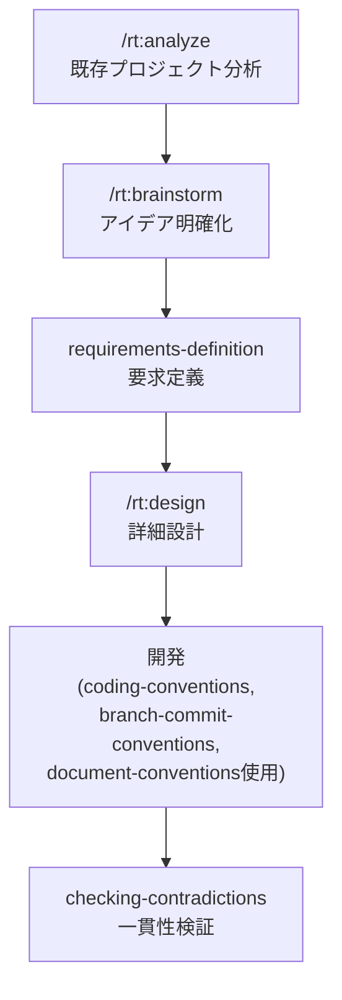

# PluginMarketplace

RevTechStudioの開発標準とベストプラクティス、システム設計・開発を支援するClaude Code用スキルコレクション。

## 概要

このリポジトリは、プロジェクトのアイデア出しから詳細設計、実装、品質保証まで、開発ライフサイクル全体をサポートする包括的なスキルセットを提供します。チーム開発における一貫性と品質を保つための標準規則、コーディングスタイル、ドキュメント作成基準に加え、システム設計と開発プロセスを効率化するツールを含みます。

## スキルパッケージ

### 1. rev-tech-studio-foundations (v0.3.2)

**カテゴリ:** `team-standards`

開発の基盤となる規約、標準、ツールを提供するスキルパッケージ。

#### 提供スキル（10種類）

**開発規約・標準**

- **development-conventions** - 開発における基本ルールとチーム相互作用のガイドライン
- **coding-conventions** - C#コーディング規約とベストプラクティス
- **branch-commit-conventions** - Conventional Commitsに基づくブランチ、コミット、PRの命名規則

**ドキュメント**

- **document-conventions** - プロジェクト全体のドキュメント作成基準（日本語、Mermaid図、markdownlint検証）
- **translator** - プログラミング領域に特化したコンテキスト考慮型の日英翻訳

**環境・ツール**

- **codespaces-setup** - GitHub Codespaces開発環境の自動セットアップ（devcontainer.json生成）
- **evaluating-libraries** - ライブラリ・パッケージの客観的評価と比較（100点スコアリングシステム）

**品質保証**

- **checking-contradictions** - プロジェクト全体の矛盾検出（ドキュメント間、ドキュメント-コード間、規約違反、設定ファイル不整合）

**拡張性**

- **skill-creator** - 新規スキル作成と既存スキルの検証・改善
- **command-creator** - 新規コマンド作成と既存コマンドの検証・改善

### 2. rev-tech-studio-sdd (v0.1.0)

**カテゴリ:** `sdd` (System Design & Development)

プロジェクトのアイデア出しから詳細設計までのライフサイクルをカバーするスキルパッケージ。

#### 提供スキル（4種類）

- **brainstorming** - Why/Who/Whatフレームワークによる深掘りアイデア出し
- **project-analyzer** - 既存プロジェクトの構造分析と情報抽出
- **requirements-definition** - アイデアから実装可能な要求定義への変換
- **detailed-design** - 要求定義から実装可能な詳細設計の作成

#### スラッシュコマンド（3種類）

プロジェクト開発フローを効率化するコマンド：

- **/rt:analyze** - プロジェクト分析と文書化（出力：`.spec/project-analysis.md`）
- **/rt:brainstorm** - 深掘りアイデア出しとコンセプト明確化（出力：`.spec/idea.md`）
- **/rt:design** - 要求定義から詳細設計仕様を作成（出力：`.spec/detailed-design.md`）

## 推奨開発フロー

## インストール

Claude Codeの設定ファイルにこのマーケットプレイスを追加してください。

## プロジェクトの特徴

- **言語:** 日本語ドキュメント（技術用語は英語）
- **哲学:** 品質優先、曖昧さ不許容、矛盾検知重視
- **技術フォーカス:** C#/.NET開発（モダンスタンダード）
- **チームコラボレーション:** 明確なコミュニケーション、明示的な意思決定、一貫性の重視

## ライセンス

MIT License - 詳細は[LICENSE](LICENSE)を参照してください。
