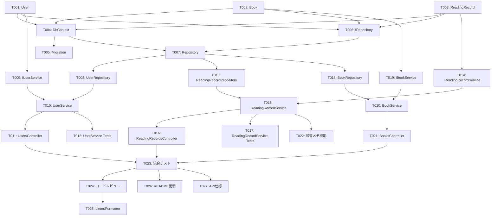

# Task Planning Skill - 使用例

このドキュメントでは、`task-planning`スキルの典型的な使用シナリオと期待される出力例を示します。

## シナリオ1: Webアプリケーションのタスク計画

### ユーザーからの依頼

```
詳細設計書（.spec/detailed-design.md）に基づいて、読書記録アプリのバックエンドAPIのタスク計画を作成してください。P1とP2機能を含めます。
```

### 実施内容

1. **詳細設計書の確認**
   - 技術スタック: ASP.NET Core Web API、Entity Framework Core、SQLite
   - システムアーキテクチャ: レイヤードアーキテクチャ
   - データベース設計: Users、Books、ReadingRecordsテーブル
   - API設計: RESTful API（CRUD操作）
   - 優先順位: P1（ユーザー管理、読書記録管理）、P2（本の検索、読書メモ）

2. **開発環境の確認**
   - .NET 8.0 SDK
   - NuGetパッケージ: Entity Framework Core、SQLite
   - テストフレームワーク: xUnit

3. **実装範囲の特定**
   - ユーザー選択: B. 初期リリース版（P1 + P2機能）

4. **タスクの分割**
   - 24タスクに分割（データモデル、リポジトリ、サービス、コントローラー、テスト）

5. **依存関係の整理**
   - データモデル → リポジトリ → サービス → コントローラー
   - 並行開発可能: Users系とBooks系、ReadingRecords系

6. **実装順序の決定**
   - フェーズ1: 基盤実装（エンティティ、DbContext、基本リポジトリ）
   - フェーズ2: コア機能実装（ユーザー管理、読書記録管理）
   - フェーズ3: 重要機能実装（本の検索、読書メモ）

7. **見積もりの作成**
   - 総作業時間: 80時間（10日間）

8. **タスク計画書の作成**
   - `.spec/task-plan.md`を作成

### 期待される出力

#### タスク計画書

```markdown
# タスク計画書 - 読書記録アプリ バックエンドAPI

## プロジェクト概要

- **プロジェクト名**: 読書記録アプリ バックエンドAPI
- **目的**: ユーザーが読んだ本を記録し、管理できるWebアプリのバックエンドAPIを提供する
- **実装範囲**: P1機能（ユーザー管理、読書記録管理）+ P2機能（本の検索、読書メモ）
- **対象ユーザー**: 読書好きの大学生、社会人

## 実装環境

### 技術スタック

- **バックエンド**: ASP.NET Core Web API 8.0
- **データベース**: SQLite + Entity Framework Core 8.0
- **テスト**: xUnit 2.6
- **ツール**: .NET CLI、Visual Studio Code

### 開発環境

- **OS**: Windows/macOS/Linux
- **SDK**: .NET 8.0 SDK
- **IDE**: Visual Studio Code + C# Dev Kit

### 依存関係

```xml
<PackageReference Include="Microsoft.EntityFrameworkCore" Version="8.0.0" />
<PackageReference Include="Microsoft.EntityFrameworkCore.Sqlite" Version="8.0.0" />
<PackageReference Include="xUnit" Version="2.6.0" />
<PackageReference Include="Moq" Version="4.20.0" />
```

## 実装フェーズ

### フェーズ1: 基盤実装（2日間、16時間）

**目標**: データモデルとデータアクセス基盤を構築する

**タスク**:
- エンティティクラスの定義（User、Book、ReadingRecord）
- ApplicationDbContextの実装
- リポジトリインターフェースの定義

**完了条件**:
- すべてのエンティティが定義されている
- DbContextが正しく設定されている
- マイグレーションが作成されている

### フェーズ2: コア機能実装（4日間、32時間）

**目標**: P1機能（ユーザー管理、読書記録管理）を実装する

**タスク**:
- ユーザー管理機能（CRUD）
- 読書記録管理機能（CRUD）
- ユニットテスト

**完了条件**:
- すべてのP1 APIエンドポイントが動作する
- ユニットテストがすべて成功する

### フェーズ3: 重要機能実装（3日間、24時間）

**目標**: P2機能（本の検索、読書メモ）を実装する

**タスク**:
- 本の検索機能
- 読書メモ機能
- 統合テスト

**完了条件**:
- すべてのP2 APIエンドポイントが動作する
- 統合テストがすべて成功する

### フェーズ4: 品質保証・ドキュメント（1日間、8時間）

**目標**: 品質チェックとドキュメントを完成させる

**タスク**:
- コードレビュー
- 品質チェック（Linter、Formatter）
- ドキュメント更新（README、API仕様）

**完了条件**:
- 品質チェックがすべて成功する
- ドキュメントが最新の状態である

## タスク一覧

### フェーズ1: 基盤実装

| ID | タスク名 | 説明 | 成果物 | 見積もり | 依存関係 | 担当者 |
|----|---------|------|--------|---------|---------|--------|
| T001 | Userエンティティの定義 | User.cs作成、プロパティ定義 | Models/User.cs | 2h | - | TBD |
| T002 | Bookエンティティの定義 | Book.cs作成、プロパティ定義 | Models/Book.cs | 2h | - | TBD |
| T003 | ReadingRecordエンティティの定義 | ReadingRecord.cs作成、プロパティ定義 | Models/ReadingRecord.cs | 2h | - | TBD |
| T004 | ApplicationDbContextの実装 | DbContext設定、DbSet定義 | Data/ApplicationDbContext.cs | 3h | T001,T002,T003 | TBD |
| T005 | マイグレーションの作成 | 初期マイグレーション作成 | Migrations/*.cs | 1h | T004 | TBD |
| T006 | リポジトリインターフェースの定義 | IRepository<T>、IUserRepository等 | Repositories/I*.cs | 3h | T001,T002,T003 | TBD |
| T007 | 汎用リポジトリの実装 | Repository<T>基底クラス | Repositories/Repository.cs | 3h | T004,T006 | TBD |

### フェーズ2: コア機能実装（P1）

| ID | タスク名 | 説明 | 成果物 | 見積もり | 依存関係 | 担当者 |
|----|---------|------|--------|---------|---------|--------|
| T008 | UserRepositoryの実装 | User用リポジトリ実装 | Repositories/UserRepository.cs | 3h | T007 | TBD |
| T009 | IUserServiceインターフェース定義 | ユーザー管理サービスIF | Services/IUserService.cs | 2h | T001 | TBD |
| T010 | UserServiceの実装 | ユーザー管理ビジネスロジック | Services/UserService.cs | 4h | T008,T009 | TBD |
| T011 | UsersControllerの実装 | ユーザー管理APIエンドポイント | Controllers/UsersController.cs | 4h | T010 | TBD |
| T012 | UserServiceのユニットテスト | UserServiceのテスト | Tests/UserServiceTests.cs | 4h | T010 | TBD |
| T013 | ReadingRecordRepositoryの実装 | ReadingRecord用リポジトリ | Repositories/ReadingRecordRepository.cs | 3h | T007 | TBD |
| T014 | IReadingRecordService定義 | 読書記録管理サービスIF | Services/IReadingRecordService.cs | 2h | T003 | TBD |
| T015 | ReadingRecordServiceの実装 | 読書記録ビジネスロジック | Services/ReadingRecordService.cs | 4h | T013,T014 | TBD |
| T016 | ReadingRecordsControllerの実装 | 読書記録APIエンドポイント | Controllers/ReadingRecordsController.cs | 4h | T015 | TBD |
| T017 | ReadingRecordServiceのユニットテスト | ReadingRecordServiceのテスト | Tests/ReadingRecordServiceTests.cs | 4h | T015 | TBD |

### フェーズ3: 重要機能実装（P2）

| ID | タスク名 | 説明 | 成果物 | 見積もり | 依存関係 | 担当者 |
|----|---------|------|--------|---------|---------|--------|
| T018 | BookRepositoryの実装 | Book用リポジトリ、検索機能 | Repositories/BookRepository.cs | 4h | T007 | TBD |
| T019 | IBookServiceインターフェース定義 | 本管理・検索サービスIF | Services/IBookService.cs | 2h | T002 | TBD |
| T020 | BookServiceの実装 | 本検索ビジネスロジック | Services/BookService.cs | 4h | T018,T019 | TBD |
| T021 | BooksControllerの実装 | 本検索APIエンドポイント | Controllers/BooksController.cs | 4h | T020 | TBD |
| T022 | 読書メモ機能の追加 | ReadingRecordにメモ機能追加 | Models/ReadingRecord.cs、Services/* | 4h | T015 | TBD |
| T023 | 統合テストの実装 | E2E統合テスト | Tests/IntegrationTests.cs | 4h | T011,T016,T021 | TBD |

### フェーズ4: 品質保証・ドキュメント

| ID | タスク名 | 説明 | 成果物 | 見積もり | 依存関係 | 担当者 |
|----|---------|------|--------|---------|---------|--------|
| T024 | コードレビュー | 全コードのレビュー | - | 2h | T023 | TBD |
| T025 | Linter/Formatter実行 | dotnet format実行、修正 | - | 2h | T024 | TBD |
| T026 | README更新 | セットアップ手順、使用方法 | README.md | 2h | T023 | TBD |
| T027 | API仕様ドキュメント作成 | エンドポイント一覧、仕様 | docs/api-spec.md | 2h | T023 | TBD |

## 依存関係図



## スケジュール

### マイルストーン

| マイルストーン | 完了予定日 | 説明 |
|--------------|-----------|------|
| M1: 基盤実装完了 | Day 2 | データモデル、DbContext、リポジトリ基盤完成 |
| M2: P1機能完了 | Day 6 | ユーザー管理、読書記録管理API完成 |
| M3: P2機能完了 | Day 9 | 本の検索、読書メモ機能完成 |
| M4: リリース準備完了 | Day 10 | 品質チェック、ドキュメント完成 |

### ガントチャート（概要）

```
Day 1-2:  [フェーズ1: 基盤実装          ]
Day 3-6:  [フェーズ2: コア機能（P1）     ]
Day 7-9:  [フェーズ3: 重要機能（P2）     ]
Day 10:   [フェーズ4: 品質保証           ]
```

### 詳細スケジュール

| フェーズ | 開始日 | 完了予定日 | 作業時間 | タスク数 |
|---------|-------|-----------|---------|---------|
| フェーズ1 | Day 1 | Day 2 | 16h | 7 |
| フェーズ2 | Day 3 | Day 6 | 32h | 10 |
| フェーズ3 | Day 7 | Day 9 | 24h | 6 |
| フェーズ4 | Day 10 | Day 10 | 8h | 4 |

**総作業時間**: 80時間（10日間、1日8時間換算）

## リスクと対策

### リスク1: Entity Framework Coreの習熟度不足

- **影響度**: 高
- **発生確率**: 中
- **影響**: タスクT004〜T007の遅延（3-5日の遅れ）
- **対策**:
  - 事前にEF Coreのチュートリアルを学習する
  - 不明点は早期にドキュメント・コミュニティで解決する
- **代替案**: Dapper等の軽量ORMへの変更を検討

### リスク2: テストカバレッジ不足

- **影響度**: 中
- **発生確率**: 中
- **影響**: 品質低下、後続のバグ修正コスト増加
- **対策**:
  - テストを実装と並行して作成する
  - カバレッジ80%以上を目標にする
- **代替案**: CI/CDにカバレッジチェックを組み込む

### リスク3: API設計の変更

- **影響度**: 中
- **発生確率**: 低
- **影響**: タスクT011、T016、T021の作り直し（1-2日の遅れ）
- **対策**:
  - 実装前にAPI仕様をユーザーと確認する
  - OpenAPI仕様で契約を明確にする
- **代替案**: バージョニング戦略で対応

### リスク4: スケジュール遅延

- **影響度**: 高
- **発生確率**: 中
- **影響**: リリース日の遅延
- **対策**:
  - 毎日の進捗確認と早期の問題検知
  - 優先度の低いタスクのスコープ調整
- **代替案**: P2機能を次のスプリントに延期

## 次のステップ

1. **タスク計画の承認**: ユーザーにタスク計画を確認してもらう
2. **実装開始**: `implementation`スキルでタスクT001から実装を開始する
3. **進捗管理**: 各タスク完了時に進捗を記録する
4. **デイリースタンドアップ**: 毎日進捗と課題を共有する（チーム開発の場合）
```

---

## シナリオ2: CLIツールのタスク計画

### ユーザーからの依頼

```
詳細設計書に基づいて、Markdownファイルのlintツールのタスク計画を作成してください。P1機能のみで、2週間以内に完了させたいです。
```

### 実施内容

1. **詳細設計書の確認**
   - 技術スタック: Python 3.11、Click（CLIフレームワーク）
   - システムアーキテクチャ: Parser、Validator、Reporter
   - P1機能: 基本的なMarkdown検証（見出し階層、リンク、コードブロック）

2. **実装範囲の特定**
   - ユーザー選択: A. 最小限のMVP（P1機能のみ）
   - 2週間（80時間）以内に完了

3. **タスクの分割**
   - 18タスクに分割

4. **実装順序の決定**
   - フェーズ1: Parserクラス
   - フェーズ2: Validatorクラス + ルール実装
   - フェーズ3: Reporterクラス + CLI

5. **見積もりの作成**
   - 総作業時間: 72時間（9日間）

### 期待される出力（抜粋）

```markdown
# タスク計画書 - Markdown Lintツール

## プロジェクト概要

- **プロジェクト名**: Markdown Lintツール
- **目的**: Markdownファイルの品質を自動チェックするCLIツールを提供する
- **実装範囲**: P1機能（基本的なMarkdown検証）
- **期限**: 2週間以内

## タスク一覧（抜粋）

| ID | タスク名 | 説明 | 見積もり | 依存関係 |
|----|---------|------|---------|---------|
| T001 | MarkdownNodeクラス定義 | ASTノード定義 | 2h | - |
| T002 | MarkdownParserクラス実装 | Markdown解析 | 6h | T001 |
| T003 | Parserユニットテスト | Parserのテスト | 4h | T002 |
| T004 | Ruleインターフェース定義 | 検証ルール基底クラス | 2h | T001 |
| T005 | HeadingStructureRule実装 | 見出し階層検証 | 4h | T004 |
| T006 | LinkValidityRule実装 | リンク検証 | 4h | T004 |
| ... | ... | ... | ... | ... |

## スケジュール

- **フェーズ1**: Day 1-3（Parserクラス、24時間）
- **フェーズ2**: Day 4-7（Validatorクラス、32時間）
- **フェーズ3**: Day 8-9（Reporterクラス + CLI、16時間）

**総作業時間**: 72時間（9日間） + バッファ8時間 = 80時間（2週間以内）
```

---

## まとめ

`task-planning`スキルは、詳細設計書を実装可能なタスク計画に落とし込むプロセスを体系的に支援します。

**主な特徴:**
- 優先順位と依存関係に基づく効率的なタスク分割
- 現実的な見積もりとスケジュール管理
- リスクの早期特定と対策
- Mermaid図による依存関係の可視化

**次のフェーズ:**
タスク計画完了後は、`implementation`スキルでタスクを順次実装します。
