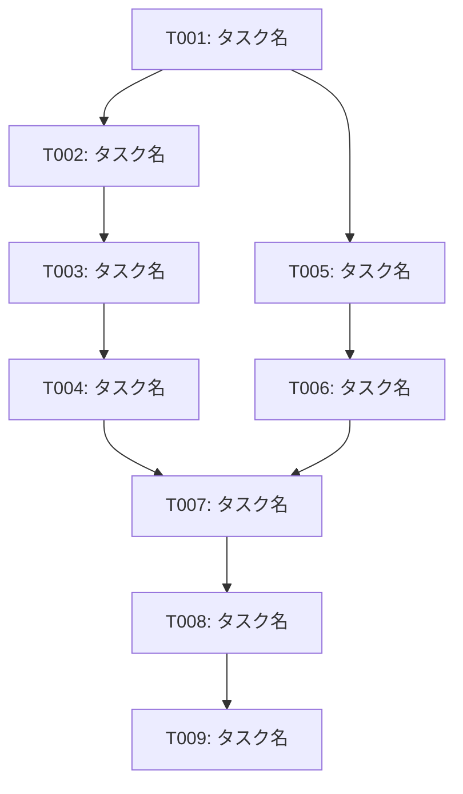

# タスク計画書 - [プロジェクト名]

## プロジェクト概要

- **プロジェクト名**: [プロジェクト名]
- **目的**: [プロジェクトの目的を1-2文で記述]
- **実装範囲**: [P1のみ / P1+P2 / P1+P2+P3]
- **対象ユーザー**: [ターゲットユーザーの説明]
- **期限**: [完了予定日]

## 実装環境

### 技術スタック

- **フロントエンド**: [技術名とバージョン]（該当する場合）
- **バックエンド**: [技術名とバージョン]
- **データベース**: [技術名とバージョン]（該当する場合）
- **テスト**: [テストフレームワーク名とバージョン]
- **ツール**: [開発ツール、ビルドツール等]

### 開発環境

- **OS**: [対応OS]
- **SDK/Runtime**: [必要なSDKやRuntimeとバージョン]
- **IDE**: [推奨IDE]

### 依存関係

[パッケージマネージャーの形式に応じて記述]

**npm/yarn（Node.js）の場合:**
```json
{
  "dependency1": "version",
  "dependency2": "version"
}
```

**pip（Python）の場合:**
```
dependency1==version
dependency2==version
```

**NuGet（.NET）の場合:**
```xml
<PackageReference Include="Dependency1" Version="version" />
<PackageReference Include="Dependency2" Version="version" />
```

## 実装フェーズ

### フェーズ1: [フェーズ名]（[X日間]、[Y時間]）

**目標**: [このフェーズで達成すべき目標]

**タスク**:
- [タスク1]
- [タスク2]
- [タスク3]

**完了条件**:
- [完了条件1]
- [完了条件2]
- [完了条件3]

### フェーズ2: [フェーズ名]（[X日間]、[Y時間]）

**目標**: [このフェーズで達成すべき目標]

**タスク**:
- [タスク1]
- [タスク2]
- [タスク3]

**完了条件**:
- [完了条件1]
- [完了条件2]
- [完了条件3]

### フェーズ3: [フェーズ名]（[X日間]、[Y時間]）

**目標**: [このフェーズで達成すべき目標]

**タスク**:
- [タスク1]
- [タスク2]
- [タスク3]

**完了条件**:
- [完了条件1]
- [完了条件2]
- [完了条件3]

### フェーズ4: [フェーズ名]（[X日間]、[Y時間]）

**目標**: [このフェーズで達成すべき目標]

**タスク**:
- [タスク1]
- [タスク2]
- [タスク3]

**完了条件**:
- [完了条件1]
- [完了条件2]
- [完了条件3]

## タスク一覧

### フェーズ1: [フェーズ名]

| ID | タスク名 | 説明 | 成果物 | 見積もり | 依存関係 | 担当者 |
|----|---------|------|--------|---------|---------|--------|
| T001 | [タスク名] | [タスクの説明] | [ファイルパス] | [Xh/Xd] | [依存タスクID] | [担当者名/TBD] |
| T002 | [タスク名] | [タスクの説明] | [ファイルパス] | [Xh/Xd] | [依存タスクID] | [担当者名/TBD] |
| T003 | [タスク名] | [タスクの説明] | [ファイルパス] | [Xh/Xd] | [依存タスクID] | [担当者名/TBD] |

### フェーズ2: [フェーズ名]

| ID | タスク名 | 説明 | 成果物 | 見積もり | 依存関係 | 担当者 |
|----|---------|------|--------|---------|---------|--------|
| T004 | [タスク名] | [タスクの説明] | [ファイルパス] | [Xh/Xd] | [依存タスクID] | [担当者名/TBD] |
| T005 | [タスク名] | [タスクの説明] | [ファイルパス] | [Xh/Xd] | [依存タスクID] | [担当者名/TBD] |
| T006 | [タスク名] | [タスクの説明] | [ファイルパス] | [Xh/Xd] | [依存タスクID] | [担当者名/TBD] |

### フェーズ3: [フェーズ名]

| ID | タスク名 | 説明 | 成果物 | 見積もり | 依存関係 | 担当者 |
|----|---------|------|--------|---------|---------|--------|
| T007 | [タスク名] | [タスクの説明] | [ファイルパス] | [Xh/Xd] | [依存タスクID] | [担当者名/TBD] |
| T008 | [タスク名] | [タスクの説明] | [ファイルパス] | [Xh/Xd] | [依存タスクID] | [担当者名/TBD] |
| T009 | [タスク名] | [タスクの説明] | [ファイルパス] | [Xh/Xd] | [依存タスクID] | [担当者名/TBD] |

### フェーズ4: [フェーズ名]

| ID | タスク名 | 説明 | 成果物 | 見積もり | 依存関係 | 担当者 |
|----|---------|------|--------|---------|---------|--------|
| T010 | [タスク名] | [タスクの説明] | [ファイルパス] | [Xh/Xd] | [依存タスクID] | [担当者名/TBD] |
| T011 | [タスク名] | [タスクの説明] | [ファイルパス] | [Xh/Xd] | [依存タスクID] | [担当者名/TBD] |
| T012 | [タスク名] | [タスクの説明] | [ファイルパス] | [Xh/Xd] | [依存タスクID] | [担当者名/TBD] |

## 依存関係図



**並行開発可能なタスクグループ:**
- グループ1: [T001, T002, T003] - [説明]
- グループ2: [T004, T005] - [説明]

## スケジュール

### マイルストーン

| マイルストーン | 完了予定日 | 説明 |
|--------------|-----------|------|
| M1: [マイルストーン名] | [Day X] | [説明] |
| M2: [マイルストーン名] | [Day Y] | [説明] |
| M3: [マイルストーン名] | [Day Z] | [説明] |
| M4: [マイルストーン名] | [Day W] | [説明] |

### ガントチャート（概要）

```
Day 1-X:  [フェーズ1: フェーズ名        ]
Day X-Y:  [フェーズ2: フェーズ名        ]
Day Y-Z:  [フェーズ3: フェーズ名        ]
Day Z-W:  [フェーズ4: フェーズ名        ]
```

### 詳細スケジュール

| フェーズ | 開始日 | 完了予定日 | 作業時間 | タスク数 |
|---------|-------|-----------|---------|---------|
| フェーズ1 | Day X | Day Y | Zh | N |
| フェーズ2 | Day Y | Day Z | Wh | M |
| フェーズ3 | Day Z | Day W | Vh | L |
| フェーズ4 | Day W | Day V | Uh | K |

**総作業時間**: [X時間]（[Y日間]、1日8時間換算）

**バッファ**: [X%]（[Z時間]）

## リスクと対策

### リスク1: [リスク名]

- **影響度**: [高/中/低]
- **発生確率**: [高/中/低]
- **影響**: [具体的な影響の説明]
- **対策**:
  - [対策1]
  - [対策2]
- **代替案**: [代替案の説明]

### リスク2: [リスク名]

- **影響度**: [高/中/低]
- **発生確率**: [高/中/低]
- **影響**: [具体的な影響の説明]
- **対策**:
  - [対策1]
  - [対策2]
- **代替案**: [代替案の説明]

### リスク3: [リスク名]

- **影響度**: [高/中/低]
- **発生確率**: [高/中/低]
- **影響**: [具体的な影響の説明]
- **対策**:
  - [対策1]
  - [対策2]
- **代替案**: [代替案の説明]

### リスク4: [リスク名]

- **影響度**: [高/中/低]
- **発生確率**: [高/中/低]
- **影響**: [具体的な影響の説明]
- **対策**:
  - [対策1]
  - [対策2]
- **代替案**: [代替案の説明]

## 前提条件

- [前提条件1]
- [前提条件2]
- [前提条件3]

## 制約事項

- [制約事項1]
- [制約事項2]
- [制約事項3]

## スコープ外

- [スコープ外の項目1]
- [スコープ外の項目2]
- [スコープ外の項目3]

## 次のステップ

1. **タスク計画の承認**: ユーザーにタスク計画を確認してもらう
2. **実装開始**: `implementation`スキルでタスク[T001]から実装を開始する
3. **進捗管理**: 各タスク完了時に進捗を記録する
4. **デイリースタンドアップ**: 毎日進捗と課題を共有する（チーム開発の場合）
5. **スプリントレビュー**: 各フェーズ完了時にレビューを実施する

## 参考資料

### 参照した設計書

- `[ファイルパス]`: [設計書名]
- `[ファイルパス]`: [設計書名]

### 参照したドキュメント

- `[ファイルパス]`: [ドキュメント名]
- `[URL]`: [外部ドキュメント名]
